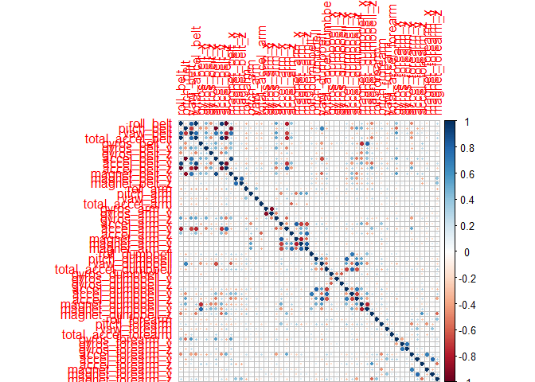

# Practical Machine Learning


## Introduction
Using devices such as Jawbone Up, Nike FuelBand, and Fitbit it is now possible to collect a large amount of data about personal activity relatively inexpensively. These type of devices are part of the quantified self movement - a group of enthusiasts who take measurements about themselves regularly to improve their health, to find patterns in their behavior, or because they are tech geeks. One thing that people regularly do is quantify how much of a particular activity they do, but they rarely quantify how well they do it. In this project, our goal will be to use data from accelerometers on the belt, forearm, arm, and dumbell of 6 participants. They were asked to perform barbell lifts correctly and incorrectly in 5 different ways. More information is available from the website here: http://groupware.les.inf.puc-rio.br/har (see the section on the Weight Lifting Exercise Dataset).

## Data

```r
library(caret)
```

```
## Loading required package: lattice
```

```
## Loading required package: ggplot2
```

```r
library(rpart)
library(rpart.plot)
library(randomForest)
```

```
## randomForest 4.6-12
```

```
## Type rfNews() to see new features/changes/bug fixes.
```

```
## 
## Attaching package: 'randomForest'
```

```
## The following object is masked from 'package:ggplot2':
## 
##     margin
```

```r
library(corrplot)
```

### Downloading

```r
srcTrainingData <-"https://d396qusza40orc.cloudfront.net/predmachlearn/pml-training.csv"
srcTestingData <- "https://d396qusza40orc.cloudfront.net/predmachlearn/pml-testing.csv"
fTrainingData <- "./data/pml-training.csv"
fTestingData  <- "./data/pml-testing.csv"
if (!file.exists("./data")) {
  dir.create("./data")
}
if (!file.exists(fTrainingData)) {
  download.file(srcTrainingData, destfile=fTrainingData)
}
if (!file.exists(fTestingData)) {
  download.file(srcTestingData, destfile=fTestingData)
}
```
### Reading

```r
TrainingData <- read.csv("./data/pml-training.csv")
TestingData <- read.csv("./data/pml-testing.csv")
dim(TrainingData)
```

```
## [1] 19622   160
```

```r
dim(TestingData)
```

```
## [1]  20 160
```

Variable CLASSE in the training data will be predicted.

### Preprocessing

```r
sum(complete.cases(TrainingData))
```

```
## [1] 406
```


```r
TrainingData <- TrainingData[, colSums(is.na(TrainingData)) == 0] 
TestingData <- TestingData[, colSums(is.na(TestingData)) == 0] 
```


```r
classe <- TrainingData$classe
trainingProcessed1 <- grepl("^X|timestamp|window", names(TrainingData))
TrainingData <- TrainingData[, !trainingProcessed1]
trainingProcessed2 <- TrainingData[, sapply(TrainingData, is.numeric)]
trainingProcessed2$classe <- classe
testingProcessed <- grepl("^X|timestamp|window", names(TestingData))
TestingData <- TestingData[, !testingProcessed]
testingProcessed2 <- TestingData[, sapply(TestingData, is.numeric)]
```

### Separation
Data will be seperated into 70% for Training and 30% for Validation


```r
set.seed(4242) # For reproducibile purpose
TrainingData3 <- createDataPartition(trainingProcessed2$classe, p=0.70, list=F)
TrainingData2 <- trainingProcessed2[TrainingData3, ]
TestingData2 <- trainingProcessed2[-TrainingData3, ]
```

## Prediction

### Random Forrest

Using the Random Forest model to predict activity

```r
RandomForrest1 <- trainControl(method="cv", 5)
RandomForrest2 <- train(classe ~ ., data=TrainingData2, method="rf", trControl=RandomForrest1, ntree=250)
RandomForrest2
```

```
## Random Forest 
## 
## 13737 samples
##    52 predictor
##     5 classes: 'A', 'B', 'C', 'D', 'E' 
## 
## No pre-processing
## Resampling: Cross-Validated (5 fold) 
## Summary of sample sizes: 10991, 10990, 10988, 10989, 10990 
## Resampling results across tuning parameters:
## 
##   mtry  Accuracy   Kappa    
##    2    0.9893721  0.9865549
##   27    0.9901001  0.9874767
##   52    0.9834754  0.9790952
## 
## Accuracy was used to select the optimal model using  the largest value.
## The final value used for the model was mtry = 27.
```

### Performance estimation
Estimation of performance against Validation data.  


```r
RandomForrest3 <- predict(RandomForrest2, TestingData2)
confusionMatrix(TestingData2$classe, RandomForrest3)
```

```
## Confusion Matrix and Statistics
## 
##           Reference
## Prediction    A    B    C    D    E
##          A 1671    2    0    0    1
##          B   11 1128    0    0    0
##          C    0    5 1017    4    0
##          D    0    0    9  955    0
##          E    0    0    3    1 1078
## 
## Overall Statistics
##                                           
##                Accuracy : 0.9939          
##                  95% CI : (0.9915, 0.9957)
##     No Information Rate : 0.2858          
##     P-Value [Acc > NIR] : < 2.2e-16       
##                                           
##                   Kappa : 0.9923          
##  Mcnemar's Test P-Value : NA              
## 
## Statistics by Class:
## 
##                      Class: A Class: B Class: C Class: D Class: E
## Sensitivity            0.9935   0.9938   0.9883   0.9948   0.9991
## Specificity            0.9993   0.9977   0.9981   0.9982   0.9992
## Pos Pred Value         0.9982   0.9903   0.9912   0.9907   0.9963
## Neg Pred Value         0.9974   0.9985   0.9975   0.9990   0.9998
## Prevalence             0.2858   0.1929   0.1749   0.1631   0.1833
## Detection Rate         0.2839   0.1917   0.1728   0.1623   0.1832
## Detection Prevalence   0.2845   0.1935   0.1743   0.1638   0.1839
## Balanced Accuracy      0.9964   0.9958   0.9932   0.9965   0.9991
```

```r
RandomForrestAccuracy <- postResample(RandomForrest3, TestingData2$classe)
RandomForrestAccuracy
```

```
##  Accuracy     Kappa 
## 0.9938828 0.9922611
```

```r
RandomForrestError <- 1 - as.numeric(confusionMatrix(TestingData2$classe, RandomForrest3)$overall[1])
RandomForrestError
```

```
## [1] 0.006117247
```

### Estimation results
Estimated accuracy: 99.38%
Estimated out-of-sample error: 0.62%.


### Prediction against Test Data 
Using the prediction model against the Test data


```r
RandomForrestPrediction <- predict(RandomForrest2, testingProcessed2[, -length(names(testingProcessed2))])
RandomForrestPrediction
```

```
##  [1] B A B A A E D B A A B C B A E E A B B B
## Levels: A B C D E
```

## Correlation Matrix

```r
RandomForrestMatrix <- cor(TrainingData2[, -length(names(TrainingData2))])
corrplot(RandomForrestMatrix, method="circle")
```

<!-- -->
